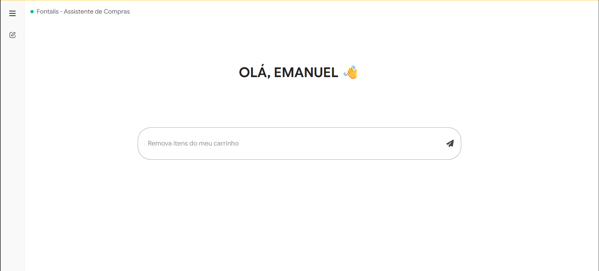
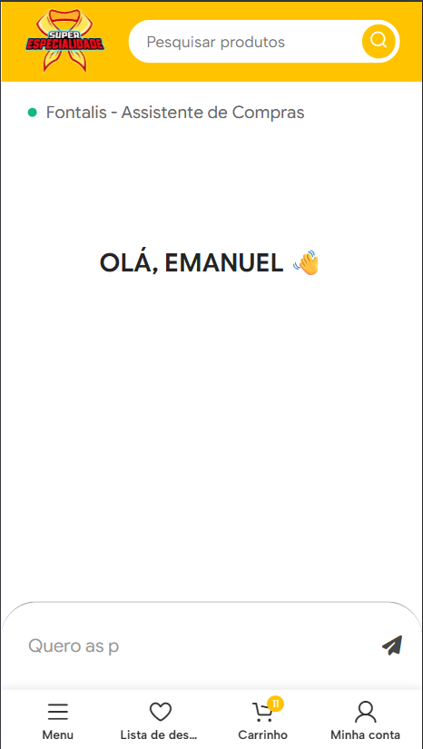

# Fontalis - AI Assistant CHATBOT


Este projeto é um plugin para WordPress que implementa um assistente virtual baseado na API Google Gemini (modelos Flash e Pro). O sistema utiliza _Function Calling_ para integrar capacidades de IA generativa com operações de e-commerce do WooCommerce, permitindo que o assistente busque produtos, gerencie o carrinho de compras e ofereça kits de especialidades baseados em regras de negócio específicas, mantendo diretrizes estritas de moderação de conteúdo.

## Screenshots

<p align="center">
  
  
</p>

<p align="center">
  <em>Interface do chat em Desktop e Mobile</em>
</p>

## Funcionalidades

- **Integração com Google Gemini API**: Utiliza modelos generativos com configuração de temperatura, TopP e TopK customizáveis.
- **WooCommerce Function Calling**: O agente pode executar ações diretas na loja:
  - `get_products`: Busca de produtos e especialidades.
  - `add_to_cart` / `remove_from_cart`: Manipulação granular do carrinho (incluindo busca fuzzy para remoção).
  - `view_cart` / `clear_cart`: Gestão completa do carrinho.
  - `get_specialty_kits`: Lógica para agrupar produtos por classes (ex: Amigo, Companheiro).
  - `create_proposed_cart`: Validação e criação de propostas de carrinho para múltiplos itens.
- **Gerenciamento de Contexto**: Histórico de conversação mantido com limite de interações configurável.
- **Segurança e Rate Limiting**: Implementação de nonces, validação de sessão e limitação de taxa de requisições por usuário/IP.
- **Analytics e Logs**: Sistema de log de auditoria e envio de métricas de uso de tokens.
- **Cache**: Estratégia de cache para resultados de funções do WooCommerce para otimizar performance.

## Requisitos

Baseado na análise do código-fonte:

- PHP >= 7.4 (Recomendado 8.0+)
- WordPress (Core files via `WPINC`)
- WooCommerce (Dependência para funções como `WC()->cart`)
- Extensão PHP `mbstring`
- Google Cloud API Key (Vertex AI ou Google AI Studio)

## Instalação

Como este projeto opera como um plugin WordPress, a instalação requer a configuração dos arquivos no diretório de plugins e a definição das chaves de API.

1. Configure as constantes necessárias no arquivo `wp-config.php` ou através do painel de opções (se implementado na interface):

```php
// Exemplo de definição via constante (se suportado pelo ambiente)
define('FONTALIS_ANALYTICS_ENDPOINT', 'https://seu-endpoint-analytics.com');
```

2. A chave da API do Gemini é gerenciada via banco de dados usando a classe `SecretsManager`.

## Uso

O núcleo do processamento ocorre na classe `FontalisBot`. Exemplo de instanciação e processamento de mensagem:

```php
use Epixel\FontalisChatBot\Core\FontalisBot;

// Inicializa o bot
$bot = new FontalisBot();

// Processa uma mensagem do usuário
// $session_id deve ser único para o visitante
$response = $bot->process_message("Gostaria de comprar o kit da classe de amigo", "sessao_usuario_123");

// Retorno
if ($response['success']) {
    echo $response['message']; // Resposta textual da IA
    // O carrinho do WooCommerce já foi atualizado automaticamente se necessário
}
```

## Estrutura do Projeto

```
fontalis-chat-popup/
├── backend/
│   ├── config/
│   │   ├── constants.php           # Definições de constantes, limites e nonces
│   │   └── security.php            # Geração de chaves de ofuscação dinâmicas
│   ├── core/
│   │   ├── FontalisBot.php         # Lógica principal, loop do agente e execução de ferramentas
│   │   ├── GeminiConfig.php        # Configuração da API Gemini e definições de Tools (Schema JSON)
│   │   └── JsonLoader.php          # Carregamento seguro de arquivos JSON
│   ├── modules/
│   │   ├── analytics/              # Tracking de uso de tokens e métricas
│   │   ├── cache/                  # Gerenciamento de cache (Redis/Transients)
│   │   ├── history/                # Histórico de conversas por sessão
│   │   ├── security/               # Rate limiting, sessões seguras, auditoria
│   │   └── woocommerce/            # Integração com carrinho e produtos
│   └── utils/
│       └── Logger.php              # Sistema de logging com sanitização
├── frontend/
│   ├── css/                        # Estilos do chat (desktop e mobile)
│   ├── js/                         # Scripts do chat com módulos ES6
│   └── templates/                  # Template PHP do widget de chat
├── includes/
│   ├── WP_Hooks.php                # Registro de hooks WordPress/AJAX
│   ├── plugin-loader.php           # Autoloader PSR-4
│   └── database-setup.php          # Criação de tabelas personalizadas
└── fontalis-chatbot.php            # Arquivo principal do plugin
```

## FAQ Técnico

### Por que existe um tratamento específico para objetos vazios no payload JSON?

Na função `encode_payload_to_json` em `FontalisBot.php`, arrays vazios em `functionCall["args"]` são convertidos explicitamente para objetos `(object) []`. Isso é necessário porque a API do Google Gemini espera que argumentos de função sejam sempre objetos JSON `{}`, e o PHP serializa arrays vazios como `[]` por padrão, o que pode causar erros de validação na API.

### Como a segurança das chaves é gerenciada em um ambiente open source?

O arquivo `backend/config/security.php` utiliza a função `wp_salt()` do WordPress para gerar uma chave de ofuscação (`FONTALIS_CHATBOT_OBFUSCATION_KEY`). Como cada instalação do WordPress possui um salt único no `wp-config.php`, a chave derivada é única para cada site, impedindo que vetores de ataque sejam replicados entre diferentes instalações do plugin.

### Como o sistema lida com o limite de tokens e loops infinitos?

A classe `FontalisBot` implementa um loop de controle com `MAX_STEPS = 5`. Isso impede que o agente entre em um ciclo infinito de chamadas de função (ex: o modelo tentando chamar uma ferramenta repetidamente). Além disso, o uso de tokens é monitorado e registrado via `Messenger` para análise de custos e performance.

## Contribuindo

Contribuições são bem-vindas! Por favor:

1. Faça um fork do projeto
2. Crie uma branch para sua feature (`git checkout -b feature/nova-funcionalidade`)
3. Commit suas mudanças (`git commit -m 'Adiciona nova funcionalidade'`)
4. Push para a branch (`git push origin feature/nova-funcionalidade`)
5. Abra um Pull Request

## Licença

Este projeto é distribuído sob a licença GPL-2.0 ou posterior, compatível com o ecossistema WordPress.

---

**Esse README foi feito com [Buildmydocs](https://buildmydocs.dev)**
